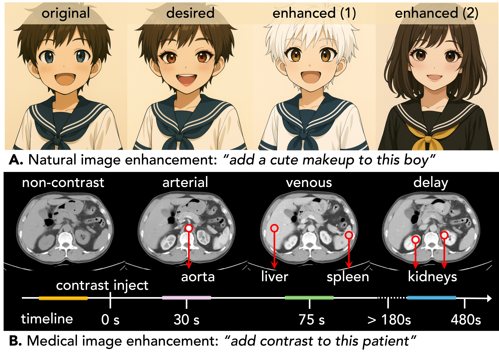

<div align="center">
  
</div>

<h1 align="center" style="font-size: 60px; margin-bottom: 4px">SMILE: Anatomy-Aware Contrast Enhancement</h1>

<div align="center">


[](https://github.com/MrGiovanni/SMILE?tab=readme-ov-file#ctverse-dataset)
[](https://github.com/MrGiovanni/SMILE?tab=readme-ov-file#smile-benchmark)
[](https://github.com/MrGiovanni/SMILE?tab=readme-ov-file#smile-model) <br/>

[](https://github.com/MrGiovanni/SMILE/stargazers) 
<a href="https://twitter.com/bodymaps317">
        
</a><br/>  

</div>


We present **SMILE** (Super Modality Image Learning and Enhancement), an anatomy-aware diffusion model for clinically reliable CT contrast enhancement. Unlike existing generative models that often over-edit and distort anatomical structures, SMILE learns the spatial and physiological relationships between organs and their contrast uptake, enhancing only clinically relevant regions while keeping others unchanged.

Our work includes **CTVerse**, a large-scale multi-phase CT dataset containing **477** patients from **112** hospitals, with all four contrast phases (non-contrast, arterial, venous, and delay). Each scan is annotated with **88** anatomical structures and tumors, resulting in **159,632** three-dimensional masks.

SMILE achieves significant improvements: **+14.2% SSIM**, **+20.6% PSNR**, **+50% FID**, and enables cancer detection from non-contrast CT scans with **+10% F1 score** improvement.

# Paper

<b>See More, Change Less: Anatomy-Aware Diffusion for Contrast Enhancement</b> <br/>
[Junqi Liu](https://scholar.google.com/citations?hl=en&authuser=1&user=4Xpspl0AAAAJ), [Zejun Wu](), [Pedro R. A. S. Bassi](), [Xinze Zhou](), [Wenxuan Li](), [Ibrahim E. Hamamci](), [Sezgin Er](), [Tianyu Lin](), [Yi Luo](), [Szymon Płotka](), [Bjoern Menze](), [Daguang Xu](), [Kai Ding](), [Kang Wang](), [Yang Yang](), [Yucheng Tang](), [Alan Yuille](https://www.cs.jhu.edu/~ayuille/), [Zongwei Zhou](https://www.zongweiz.com/)<sup>★</sup> <br/>
Johns Hopkins University, University of Copenhagen, University of Virginia, University of Bologna, and others

<a href='https://www.zongweiz.com/dataset'></a> <a href='https://www.cs.jhu.edu/~zongwei/preprint/liu2025see.pdf'></a>

# CTVerse Dataset

```shell
git clone https://github.com/MrGiovanni/SMILE.git
cd SMILE
bash download_CTVerse_data.sh # It needs storage for multi-phase CT scans
bash download_CTVerse_label.sh 
# This work is currently under peer review, but early access is available!
# To request the CTVerse dataset files, please email Zongwei Zhou at zzhou82@jh.edu
```

#### Official training set
- CTVerse-tr (*n*=382)

#### Official *in-distribution* test set 

- CTVerse-te (*n*=95)

#### Four contrast phases per patient

> [!NOTE]
> Each patient has four contrast phases captured at different timepoints:
> - **Non-contrast (N)**: Baseline scan before contrast injection (0s)
> - **Arterial (A)**: Highlights arteries and early vascular structures (30s)
> - **Venous (V)**: Enhances organs such as liver and spleen (75s)
> - **Delay (D)**: Shows mainly urinary system (>180s)

#### Anatomical annotations

- **88 anatomical structures** including organs, vessels, bones, and disease regions
- **159,632 three-dimensional masks** total across all patients and phases
- Annotations for **pancreatic, liver, and kidney tumors**

# SMILE Benchmark (official in-distribution test set)

> [!NOTE]
> We are calling for more baseline methods. 

| model  | paper | github | SSIM | PSNR | FID | Intensity Correlation |
|:---|:---|:---|:---:|:---:|:---:|:---:|
| Pix2Pix | [](https://arxiv.org/abs/1611.07004) | [](https://github.com/phillipi/pix2pix)
| CycleGAN | [](https://arxiv.org/abs/1703.10593) | [](https://github.com/junyanz/CycleGAN)
| DDPM | [](https://arxiv.org/abs/2006.11239) | [](https://github.com/hojonathanho/diffusion)
| Stable Diffusion | [](https://arxiv.org/abs/2112.10752) | [](https://github.com/CompVis/stable-diffusion)
| ControlNet | [](https://arxiv.org/abs/2302.05543) | [](https://github.com/lllyasviel/ControlNet)
| SMILE | [](https://arxiv.org/abs/TBD) | [](https://github.com/MrGiovanni/SMILE)

# SMILE Model 

> [!NOTE]
> Model checkpoints will be released upon paper acceptance. Stay tuned!

**Key Features:**
- **Structure-aware supervision** that guides enhancements to follow realistic organ boundaries and contrast dynamics
- **Registration-free generation** that learns directly from unaligned multi-phase CT scans without voxel-wise registration
- **Unified inference** for efficient, consistent enhancement across multiple contrast phases in a single diffusion pipeline

**Clinical Applications:**
- Opportunistic cancer screening from non-contrast CT scans
- Enhanced tumor detection without additional contrast injection
- Accessible diagnostic imaging for patients who cannot receive contrast agents

# Citation

```
@article{liu2025see,
  title={See More, Change Less: Anatomy-Aware Diffusion for Contrast Enhancement},
  author={Liu, Junqi and Wu, Zejun and Bassi, Pedro RAS and Zhou, Xinze and Li, Wenxuan and Hamamci, Ibrahim E and Er, Sezgin and Lin, Tianyu and Luo, Yi and Płotka, Szymon and others},
  journal={arXiv preprint arXiv:TBD},
  year={2025},
  url={https://github.com/MrGiovanni/SMILE}
}
```

# Acknowledgement

This work was supported by the Lustgarten Foundation for Pancreatic Cancer Research, the Patrick J. McGovern Foundation Award, and the National Institutes of Health (NIH) under Award Number R01EB037669. We would like to thank the Johns Hopkins Research IT team in [IT@JH](https://researchit.jhu.edu/) for their support and infrastructure resources where some of these analyses were conducted; especially [DISCOVERY HPC](https://researchit.jhu.edu/research-hpc/). Paper content is covered by patents pending.